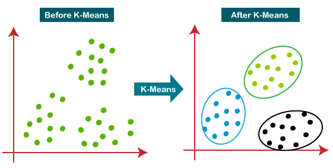

# Clustring Of Brain MRI With Kmeans & MapReduce 
<b>Description :</b>This project consist of Clustering of a cerebral MRI image. The image is in grid level (grayscale image) where the value of each pixel is between 0 and 255 (0 represents the black color and 255 represents the white color). The image shows three parts of the brain namely white matter, gray matter and cerebrospinal fluid, the objective is to know the pixels of each part.

# Kmeans ? 
Its a classic clustering algorithm that relies on the concept of centroids and their Euclidean distances from the observed data points. The basic concept works on the following set of rules:

1. Assign a fixed number of centroids randomly in the parameter space (the number of centroids will define the number of clusters formed at the end of execution of the algorithm). These centroids need not be one of the points in the observation set, and can literally be random coordinates in the multi-dimensional space that we have.
2. Calculate the closest centroid from each data point in the observation set and assign the data point to that centroid's cluster.
3. Move the centroid to the 'center-of-mass' of the cluster that it has created with help of our data points from observation set.
4. Repeat **Step 2** and see if any points have changed their clusters, from the ones they were previously assigned. If the condition holds true then move to **Step 3** otherwise proceed to **Step 5**. 
5. Finish
6. 

# MapReduce ?
Its a programming model or pattern within the Hadoop framework that is used to access big data stored in the Hadoop File System (HDFS). It is a core component, integral to the functioning of the Hadoop framework.

<b>MapReduce</b> facilitates concurrent processing by splitting petabytes of data into smaller chunks, and processing them in <b>parallel</b> on Hadoop commodity servers. In the end, it aggregates all the data from multiple servers to return a consolidated output back to the application.
The Map Reduce algorithm basically consists of two main functions <b>Map</b> and <b>Reduce</b>. Between these two main functions executed in parallel we find different steps that the code must execute, being as follows: 

<b>Input</b> -> <b>Splitting</b> -> <b>Mapping</b> -> <b>Shuffling</b> -> <b>Reducing</b> -> <b>Final result</b>

# Implementation
|Original Image|White Matter|Gray Matter|Cerebrospinal Fluid|
|:------:|:------:|:------:|:------:|
|||||
